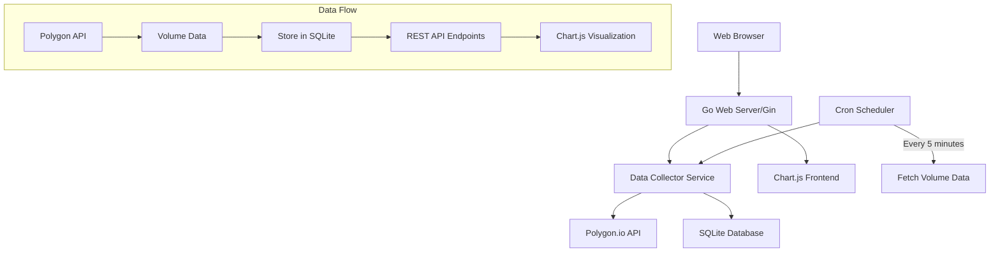

# Trading Volume Tracking Web App - Implementation Plan

## Project Overview

Building a web application to track trading volume for stocks similar to unusualwhales.com functionality. The app will collect real-time volume data from Polygon.io API and display it using interactive charts.

## Target Stocks
- PLTR (Palantir Technologies)
- TSLA (Tesla)
- BBAI (BigBear.ai)
- MSFT (Microsoft)
- NPWR (NET Power)

## Technology Stack

### Backend
- **Language**: Go
- **Web Framework**: Gin (lightweight HTTP framework)
- **Database**: SQLite (local storage)
- **API Client**: polygon-io/client-go
- **Data Source**: Polygon.io REST API

### Frontend
- **Charts**: Chart.js (for full control over data visualization)
- **UI**: HTML5 + CSS3 + Vanilla JavaScript
- **Styling**: Bootstrap or custom CSS for responsive design
- **Real-time Updates**: WebSockets or Server-Sent Events

## Architecture Overview



## Database Schema

```sql
-- Volume data table
CREATE TABLE volume_data (
    id INTEGER PRIMARY KEY AUTOINCREMENT,
    symbol TEXT NOT NULL,
    timestamp DATETIME NOT NULL,
    volume INTEGER NOT NULL,
    price DECIMAL(10,2),
    open_price DECIMAL(10,2),
    high_price DECIMAL(10,2),
    low_price DECIMAL(10,2),
    close_price DECIMAL(10,2),
    created_at DATETIME DEFAULT CURRENT_TIMESTAMP,
    UNIQUE(symbol, timestamp)
);

-- Index for faster queries
CREATE INDEX idx_symbol_timestamp ON volume_data(symbol, timestamp);
CREATE INDEX idx_timestamp ON volume_data(timestamp);
```

## Project Structure

```
market-watch-go/
├── cmd/
│   └── server/
│       └── main.go              # Main application entry point
├── internal/
│   ├── config/
│   │   └── config.go           # Configuration management
│   ├── database/
│   │   ├── sqlite.go           # Database connection and setup
│   │   └── migrations.go       # Database migrations
│   ├── handlers/
│   │   ├── volume.go           # Volume data HTTP handlers
│   │   └── dashboard.go        # Dashboard handlers
│   ├── models/
│   │   └── volume.go           # Volume data models
│   ├── services/
│   │   ├── collector.go        # Data collection service
│   │   ├── scheduler.go        # Periodic data fetching
│   │   └── polygon.go          # Polygon API service
│   └── middleware/
│       └── cors.go             # CORS middleware
├── pkg/
│   └── utils/
│       └── time.go             # Time utilities
├── web/
│   ├── static/
│   │   ├── css/
│   │   │   └── styles.css      # Custom styling
│   │   ├── js/
│   │   │   ├── charts.js       # Chart.js configuration
│   │   │   └── dashboard.js    # Dashboard functionality
│   │   └── lib/
│   │       └── chart.min.js    # Chart.js library
│   └── templates/
│       ├── index.html          # Main dashboard
│       └── layout.html         # Base template
├── configs/
│   └── config.yaml             # Application configuration
├── data/
│   └── market-watch.db         # SQLite database (auto-created)
├── go.mod
├── go.sum
├── .env.example                # Environment variables template
├── .gitignore
└── README.md
```

## Implementation Phases

### Phase 1: Core Backend Infrastructure

1. **Project Setup**
   - Initialize Go module
   - Install dependencies (Gin, SQLite driver, Polygon client)
   - Set up basic project structure

2. **Database Layer**
   - SQLite connection and initialization
   - Volume data model and schema
   - Database migration system

3. **Polygon API Integration**
   - Configure Polygon.io client
   - Implement volume data fetching
   - Error handling and rate limiting

4. **Data Collection Service**
   - Scheduled data collection (every 5 minutes)
   - Data validation and storage
   - Logging and monitoring

### Phase 2: Web Server and API

1. **HTTP Server Setup**
   - Gin router configuration
   - CORS middleware
   - Static file serving

2. **REST API Endpoints**
   - `GET /api/volume/:symbol` - Get volume data for symbol
   - `GET /api/volume/:symbol/latest` - Get latest volume data
   - `GET /api/volume/:symbol/range?from=&to=` - Get volume data for date range
   - `GET /api/dashboard/summary` - Get summary for all tracked symbols

3. **Error Handling**
   - Structured error responses
   - Request validation
   - Rate limiting

### Phase 3: Frontend Implementation

1. **Chart.js Integration**
   - Volume line charts with time series
   - Interactive tooltips and zoom
   - Real-time data updates
   - Multiple chart views (1H, 4H, 1D, 1W)

2. **Dashboard Interface**
   - Responsive grid layout for 5 stock charts
   - Symbol selector and time range controls
   - Volume statistics display
   - Auto-refresh functionality

3. **User Experience**
   - Loading states and error handling
   - Mobile-responsive design
   - Dark/light theme support

### Phase 4: Advanced Features

1. **Real-time Updates**
   - WebSocket connection for live data
   - Automatic chart updates
   - Connection status indicator

2. **Data Management**
   - Data retention policy (30 days)
   - Data export functionality
   - Performance optimization

## API Endpoints Specification

### Volume Data Endpoints

```go
// Get volume data for a specific symbol
GET /api/volume/{symbol}
Query Parameters:
- from: start date (YYYY-MM-DD)
- to: end date (YYYY-MM-DD)
- interval: 5m, 15m, 1h, 4h, 1d (default: 5m)

// Get latest volume data for a symbol
GET /api/volume/{symbol}/latest

// Get dashboard summary
GET /api/dashboard/summary
```

### Response Formats

```json
{
  "symbol": "TSLA",
  "data": [
    {
      "timestamp": "2025-05-31T10:00:00Z",
      "volume": 1250000,
      "price": 195.50,
      "open": 194.20,
      "high": 196.80,
      "low": 193.90,
      "close": 195.50
    }
  ],
  "total_records": 288,
  "from": "2025-05-31T00:00:00Z",
  "to": "2025-05-31T23:59:59Z"
}
```

## Chart.js Configuration

### Volume Chart Features
- **Chart Type**: Line chart with filled area
- **Time Scale**: X-axis with time-based scaling
- **Volume Scale**: Y-axis with volume formatting (K, M, B)
- **Interactivity**: Zoom, pan, tooltip with volume/price info
- **Styling**: Professional color scheme, grid lines, legends

### Chart Layout
```
+----------------------------------+
|  [PLTR]    [TSLA]    [BBAI]     |
|  Volume    Volume    Volume      |
|  Chart     Chart     Chart       |
+----------------------------------+
|  [MSFT]    [NPWR]               |
|  Volume    Volume               |
|  Chart     Chart                |
+----------------------------------+
```

## Configuration Management

### Environment Variables
```bash
POLYGON_API_KEY=your_polygon_api_key
DATABASE_PATH=./data/market-watch.db
SERVER_PORT=8080
LOG_LEVEL=info
COLLECTION_INTERVAL=5m
```

### Configuration File (config.yaml)
```yaml
server:
  port: 8080
  host: localhost
  
database:
  path: "./data/market-watch.db"
  
polygon:
  api_key: "${POLYGON_API_KEY}"
  base_url: "https://api.polygon.io"
  
collection:
  interval: "5m"
  symbols:
    - "PLTR"
    - "TSLA" 
    - "BBAI"
    - "MSFT"
    - "NPWR"
    
logging:
  level: "info"
  format: "json"
```

## Data Collection Strategy

### Polygon.io API Endpoints
- **Aggregates (Bars)**: `/v2/aggs/ticker/{stocksTicker}/range/{multiplier}/{timespan}/{from}/{to}`
- **Real-time Data**: WebSocket streams for live updates
- **Rate Limits**: 5 API calls per minute (free tier)

### Collection Schedule
- **Frequency**: Every 5 minutes during market hours
- **Market Hours**: 9:30 AM - 4:00 PM ET (weekdays)
- **Data Retention**: 30 days of historical data
- **Batch Processing**: Collect all 5 symbols in single API call when possible

## Error Handling Strategy

### API Errors
- Polygon API rate limits
- Network connectivity issues  
- Invalid API responses
- Market closure handling

### Database Errors
- Connection failures
- Constraint violations
- Data corruption recovery

### Frontend Errors
- Chart rendering failures
- Network request timeouts
- Data format mismatches

## Future Enhancements (Phase 5)

### Volume Deviation Alerts
1. **Algorithm**: Calculate rolling averages and standard deviations
2. **Thresholds**: Configurable alert levels (2x, 3x, 5x average)
3. **Notifications**: Email, SMS, or browser notifications
4. **Alert History**: Track and display past alerts

### Advanced Analytics
- Volume profile analysis
- Unusual volume detection algorithms
- Correlation analysis between stocks
- Technical indicators integration

## Success Metrics

### Technical Metrics
- Data collection reliability (>99% uptime)
- API response times (<500ms)
- Chart rendering performance (<1s load time)
- Database query optimization (<100ms)

### User Experience Metrics
- Dashboard load time
- Chart interactivity responsiveness
- Mobile device compatibility
- Browser compatibility (Chrome, Firefox, Safari, Edge)

## Development Timeline

### Week 1: Backend Foundation
- Project setup and dependencies
- Database schema and models
- Polygon API integration
- Basic data collection

### Week 2: Web Server and API
- HTTP server setup
- REST API endpoints
- Error handling and validation
- Basic frontend structure

### Week 3: Chart Implementation
- Chart.js integration
- Dashboard layout
- Real-time data updates
- Responsive design

### Week 4: Testing and Polish
- End-to-end testing
- Performance optimization
- Documentation
- Deployment preparation

This plan provides a solid foundation for building a professional trading volume tracking application with room for future enhancements and scalability.
