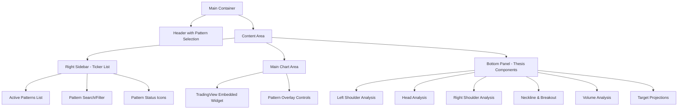

# Inverse Head and Shoulders Pattern Monitoring UI - Technical Design Plan

## Executive Summary

This plan outlines the development of a specialized UI for detecting, monitoring, and tracking inverse head and shoulders patterns with detailed thesis components. The system will focus on backend pattern recognition with real-time monitoring and email notifications as thesis conditions are fulfilled.

## System Architecture Overview

The solution extends the existing market watch application with:
- **Backend Extensions**: New pattern detection services, database schema, and monitoring logic
- **Frontend Interface**: Dedicated UI with ticker sidebar, TradingView charts, and detailed thesis tracking
- **Real-time Monitoring**: 5-minute refresh cycles with email notifications for thesis completion
- **Integration**: Seamless integration with existing setup detection and email systems

## UI Layout Architecture



## Backend Architecture Extensions

### 1. Enhanced Data Models

#### Pattern-Specific Structures

```go
// New pattern types to add to models/setup.go
const (
    SetupTypeInverseHeadShoulders = "inverse_head_shoulders"
    SetupTypeHeadShoulders       = "head_shoulders"
)

// Extended pattern-specific data structures
type HeadShouldersPattern struct {
    ID               int64                    `json:"id" db:"id"`
    SetupID          int64                    `json:"setup_id" db:"setup_id"`
    Symbol           string                   `json:"symbol" db:"symbol"`
    PatternType      string                   `json:"pattern_type" db:"pattern_type"` // "inverse_head_shoulders" or "head_shoulders"
    
    // Pattern Points
    LeftShoulderHigh  PatternPoint            `json:"left_shoulder_high"`
    LeftShoulderLow   PatternPoint            `json:"left_shoulder_low"`
    HeadHigh          PatternPoint            `json:"head_high"`
    HeadLow           PatternPoint            `json:"head_low"`
    RightShoulderHigh PatternPoint            `json:"right_shoulder_high"`
    RightShoulderLow  PatternPoint            `json:"right_shoulder_low"`
    
    // Neckline Analysis
    NecklineLevel     float64                 `json:"neckline_level" db:"neckline_level"`
    NecklineSlope     float64                 `json:"neckline_slope" db:"neckline_slope"`
    NecklineTouch1    PatternPoint            `json:"neckline_touch1"`
    NecklineTouch2    PatternPoint            `json:"neckline_touch2"`
    
    // Pattern Measurements
    PatternWidth      time.Duration           `json:"pattern_width"`
    PatternHeight     float64                 `json:"pattern_height" db:"pattern_height"`
    Symmetry          float64                 `json:"symmetry" db:"symmetry"` // 0-100 score
    
    // Thesis Tracking
    ThesisComponents  HeadShouldersThesis     `json:"thesis_components"`
    
    // Status
    DetectedAt        time.Time               `json:"detected_at" db:"detected_at"`
    LastUpdated       time.Time               `json:"last_updated" db:"last_updated"`
    IsComplete        bool                    `json:"is_complete" db:"is_complete"`
}

type PatternPoint struct {
    Timestamp         time.Time               `json:"timestamp"`
    Price             float64                 `json:"price"`
    Volume            int64                   `json:"volume"`
    VolumeRatio       float64                 `json:"volume_ratio"` // vs average
}

type HeadShouldersThesis struct {
    // Left Shoulder Components
    LeftShoulderFormed    ThesisComponent     `json:"left_shoulder_formed"`
    LeftShoulderVolume    ThesisComponent     `json:"left_shoulder_volume"`
    
    // Head Components  
    HeadFormed            ThesisComponent     `json:"head_formed"`
    HeadVolumeSpike       ThesisComponent     `json:"head_volume_spike"`
    HeadLowerLow          ThesisComponent     `json:"head_lower_low"` // For inverse H&S
    
    // Right Shoulder Components
    RightShoulderFormed   ThesisComponent     `json:"right_shoulder_formed"`
    RightShoulderSymmetry ThesisComponent     `json:"right_shoulder_symmetry"`
    RightShoulderVolume   ThesisComponent     `json:"right_shoulder_volume"`
    
    // Neckline Components
    NecklineEstablished   ThesisComponent     `json:"neckline_established"`
    NecklineRetest        ThesisComponent     `json:"neckline_retest"`
    NecklineBreakout      ThesisComponent     `json:"neckline_breakout"`
    BreakoutVolume        ThesisComponent     `json:"breakout_volume"`
    
    // Target Components
    TargetProjected       ThesisComponent     `json:"target_projected"`
    PartialFillT1         ThesisComponent     `json:"partial_fill_t1"`
    PartialFillT2         ThesisComponent     `json:"partial_fill_t2"`
    FullTarget            ThesisComponent     `json:"full_target"`
    
    // Overall Status
    CompletedComponents   int                 `json:"completed_components"`
    TotalComponents      int                 `json:"total_components"`
    CompletionPercent    float64             `json:"completion_percent"`
    CurrentPhase         string              `json:"current_phase"` // "formation", "breakout", "target_pursuit"
}

type ThesisComponent struct {
    Name              string                  `json:"name"`
    Description       string                  `json:"description"`
    IsCompleted       bool                    `json:"is_completed"`
    CompletedAt       *time.Time              `json:"completed_at,omitempty"`
    IsRequired        bool                    `json:"is_required"`
    Weight            float64                 `json:"weight"` // Importance weight
    ConfidenceLevel   float64                 `json:"confidence_level"` // 0-100
    Evidence          []string                `json:"evidence"` // Supporting data points
    LastChecked       time.Time               `json:"last_checked"`
    AutoDetected      bool                    `json:"auto_detected"`
    NotificationSent  bool                    `json:"notification_sent"`
}
```

### 2. Pattern Detection Service

```go
// services/head_shoulders_detection.go
type HeadShouldersDetectionService struct {
    db                 *database.DB
    setupService       *SetupDetectionService
    emailService       *EmailService
    patternConfig      *HeadShouldersConfig
}

type HeadShouldersConfig struct {
    MinPatternDuration    time.Duration `json:"min_pattern_duration"`
    MaxPatternDuration    time.Duration `json:"max_pattern_duration"`
    MinSymmetryScore      float64       `json:"min_symmetry_score"`
    MinVolumeIncrease     float64       `json:"min_volume_increase"`
    NecklineDeviation     float64       `json:"neckline_deviation"`
    TargetMultiplier      float64       `json:"target_multiplier"`
}

func (hsds *HeadShouldersDetectionService) DetectInverseHeadShoulders(symbol string) (*HeadShouldersPattern, error) {
    // 1. Get price data for analysis window (typically 3-6 months)
    // 2. Identify potential shoulders and head using peak/trough detection
    // 3. Validate pattern geometry (symmetry, proportions)
    // 4. Calculate neckline using linear regression
    // 5. Assess volume characteristics at each point
    // 6. Create thesis components with initial states
    // 7. Store pattern and setup in database
}

func (hsds *HeadShouldersDetectionService) MonitorActivePatterns() error {
    // 1. Get all active H&S patterns from database
    // 2. Update thesis components based on latest market data
    // 3. Check for breakout conditions and volume confirmation
    // 4. Send notifications for newly completed components
    // 5. Update pattern completion status
    // 6. Archive completed patterns after target achievement
}

func (hsds *HeadShouldersDetectionService) UpdateThesisComponent(patternID int64, componentName string, isCompleted bool, evidence []string) error {
    // Update specific thesis component with new evidence and completion status
}
```

### 3. Database Schema Extensions

```sql
-- Head and Shoulders specific pattern table
CREATE TABLE head_shoulders_patterns (
    id INTEGER PRIMARY KEY AUTOINCREMENT,
    setup_id INTEGER NOT NULL,
    symbol TEXT NOT NULL,
    pattern_type TEXT NOT NULL, -- 'inverse_head_shoulders' or 'head_shoulders'
    
    -- Pattern Points (JSON stored as TEXT)
    left_shoulder_high TEXT NOT NULL,
    left_shoulder_low TEXT NOT NULL,
    head_high TEXT NOT NULL,
    head_low TEXT NOT NULL,
    right_shoulder_high TEXT,
    right_shoulder_low TEXT,
    
    -- Neckline Analysis
    neckline_level REAL,
    neckline_slope REAL,
    neckline_touch1 TEXT,
    neckline_touch2 TEXT,
    
    -- Pattern Measurements
    pattern_width INTEGER, -- Duration in minutes
    pattern_height REAL,
    symmetry REAL,
    
    -- Status
    detected_at DATETIME NOT NULL,
    last_updated DATETIME NOT NULL,
    is_complete BOOLEAN DEFAULT FALSE,
    
    FOREIGN KEY (setup_id) REFERENCES trading_setups(id)
);

-- Thesis components tracking table
CREATE TABLE thesis_components (
    id INTEGER PRIMARY KEY AUTOINCREMENT,
    pattern_id INTEGER NOT NULL,
    component_name TEXT NOT NULL,
    component_type TEXT NOT NULL, -- 'formation', 'volume', 'breakout', 'target'
    description TEXT,
    is_completed BOOLEAN DEFAULT FALSE,
    completed_at DATETIME,
    is_required BOOLEAN DEFAULT FALSE,
    weight REAL DEFAULT 1.0,
    confidence_level REAL DEFAULT 0.0,
    evidence TEXT, -- JSON array of evidence
    last_checked DATETIME NOT NULL,
    auto_detected BOOLEAN DEFAULT TRUE,
    notification_sent BOOLEAN DEFAULT FALSE,
    
    FOREIGN KEY (pattern_id) REFERENCES head_shoulders_patterns(id)
);

-- Pattern monitoring alerts
CREATE TABLE pattern_alerts (
    id INTEGER PRIMARY KEY AUTOINCREMENT,
    pattern_id INTEGER NOT NULL,
    component_name TEXT NOT NULL,
    alert_type TEXT NOT NULL, -- 'component_completed', 'breakout_confirmed', 'target_reached'
    message TEXT NOT NULL,
    triggered_at DATETIME NOT NULL,
    notification_sent BOOLEAN DEFAULT FALSE,
    email_sent BOOLEAN DEFAULT FALSE,
    
    FOREIGN KEY (pattern_id) REFERENCES head_shoulders_patterns(id)
);
```

## Frontend UI Implementation

### 1. Main Layout Structure

```html
<!-- New dedicated page: web/templates/inverse-head-shoulders.html -->
<!DOCTYPE html>
<html lang="en" data-bs-theme="dark">
<head>
    <meta charset="UTF-8">
    <meta name="viewport" content="width=device-width, initial-scale=1.0">
    <title>Inverse Head & Shoulders Monitor - Market Watch</title>
    
    <!-- Bootstrap 5 CSS -->
    <link href="https://cdn.jsdelivr.net/npm/bootstrap@5.3.2/dist/css/bootstrap.min.css" rel="stylesheet">
    <!-- Bootstrap Icons -->
    <link href="https://cdn.jsdelivr.net/npm/bootstrap-icons@1.11.1/font/bootstrap-icons.css" rel="stylesheet">
    <!-- TradingView Widgets -->
    <script type="text/javascript" src="https://s3.tradingview.com/tv.js"></script>
    <!-- Custom CSS -->
    <link href="/static/css/styles.css" rel="stylesheet">
    <link href="/static/css/head-shoulders.css" rel="stylesheet">
</head>

<body>
    <div class="container-fluid h-100">
        <!-- Header -->
        <nav class="navbar navbar-expand-lg navbar-dark sticky-top">
            <div class="container-fluid">
                <a class="navbar-brand" href="/">
                    <i class="bi bi-graph-up-arrow me-2"></i>Inverse Head & Shoulders Monitor
                </a>
                <div class="navbar-nav ms-auto">
                    <div class="nav-item dropdown">
                        <button class="btn btn-outline-primary dropdown-toggle" data-bs-toggle="dropdown">
                            <i class="bi bi-funnel"></i> Pattern Filter
                        </button>
                        <ul class="dropdown-menu">
                            <li><a class="dropdown-item" href="#" data-filter="all">All Patterns</a></li>
                            <li><a class="dropdown-item" href="#" data-filter="forming">In Formation</a></li>
                            <li><a class="dropdown-item" href="#" data-filter="complete">Pattern Complete</a></li>
                            <li><a class="dropdown-item" href="#" data-filter="breakout">Breakout Phase</a></li>
                            <li><a class="dropdown-item" href="#" data-filter="target">Target Pursuit</a></li>
                        </ul>
                    </div>
                </div>
            </div>
        </nav>

        <!-- Main Content -->
        <div class="row h-100">
            <!-- Chart Area (Left 70%) -->
            <div class="col-lg-8 col-xl-9 h-100 p-0">
                <div class="card h-100 rounded-0">
                    <div class="card-header d-flex justify-content-between align-items-center">
                        <div>
                            <h5 class="mb-0" id="selected-symbol">Select a pattern to view chart</h5>
                            <small class="text-muted" id="pattern-status">No pattern selected</small>
                        </div>
                        <div class="btn-group btn-group-sm">
                            <button class="btn btn-outline-secondary" id="toggle-pattern-overlay">
                                <i class="bi bi-eye"></i> Show Pattern
                            </button>
                            <button class="btn btn-outline-secondary" id="toggle-thesis-overlay">
                                <i class="bi bi-list-check"></i> Show Thesis
                            </button>
                        </div>
                    </div>
                    <div class="card-body p-0 position-relative">
                        <!-- TradingView Widget Container -->
                        <div id="tradingview-widget" class="w-100 h-100"></div>
                        
                        <!-- Pattern Overlay -->
                        <div id="pattern-overlay" class="position-absolute top-0 start-0 w-100 h-100 pointer-events-none">
                            <!-- SVG overlay for pattern lines and annotations -->
                        </div>
                    </div>
                </div>
            </div>

            <!-- Right Sidebar (30%) -->
            <div class="col-lg-4 col-xl-3 h-100 p-0">
                <div class="card h-100 rounded-0">
                    <div class="card-header">
                        <div class="d-flex justify-content-between align-items-center">
                            <h6 class="mb-0">
                                <i class="bi bi-graph-up-arrow me-2"></i>Active Patterns
                            </h6>
                            <span class="badge bg-primary" id="pattern-count">0</span>
                        </div>
                    </div>
                    <div class="card-body p-0">
                        <!-- Pattern Search -->
                        <div class="p-3 border-bottom">
                            <div class="input-group input-group-sm">
                                <span class="input-group-text">
                                    <i class="bi bi-search"></i>
                                </span>
                                <input type="text" class="form-control" id="pattern-search" 
                                       placeholder="Search symbol...">
                            </div>
                        </div>
                        
                        <!-- Patterns List -->
                        <div id="patterns-list" class="overflow-auto" style="height: calc(100vh - 200px);">
                            <!-- Pattern items will be inserted here -->
                        </div>
                    </div>
                </div>
            </div>
        </div>

        <!-- Bottom Thesis Panel (Collapsible) -->
        <div class="position-fixed bottom-0 start-0 w-100" id="thesis-panel" 
             style="transform: translateY(calc(100% - 60px)); transition: transform 0.3s ease;">
            <div class="card rounded-0 shadow-lg">
                <div class="card-header bg-dark text-light cursor-pointer" id="thesis-panel-header">
                    <div class="d-flex justify-content-between align-items-center">
                        <h6 class="mb-0">
                            <i class="bi bi-list-check me-2"></i>Thesis Components
                            <span id="thesis-symbol" class="text-muted ms-2">- No pattern selected</span>
                        </h6>
                        <div class="d-flex align-items-center">
                            <div class="progress me-3" style="width: 100px; height: 20px;">
                                <div class="progress-bar" id="thesis-progress" style="width: 0%"></div>
                            </div>
                            <span id="thesis-completion" class="text-light me-3">0/0</span>
                            <i class="bi bi-chevron-up" id="thesis-panel-toggle"></i>
                        </div>
                    </div>
                </div>
                <div class="card-body" style="height: 400px; overflow-y: auto;">
                    <div id="thesis-content">
                        <!-- Thesis components will be loaded here -->
                    </div>
                </div>
            </div>
        </div>
    </div>

    <!-- Bootstrap 5 JS Bundle -->
    <script src="https://cdn.jsdelivr.net/npm/bootstrap@5.3.2/dist/js/bootstrap.bundle.min.js"></script>
    <!-- Custom JavaScript -->
    <script src="/static/js/head-shoulders.js"></script>
</body>
</html>
```

### 2. Pattern List Item Template

```html
<!-- Pattern List Item Template -->
<div class="pattern-item border-bottom p-3 cursor-pointer" data-pattern-id="{pattern_id}" data-symbol="{symbol}">
    <div class="d-flex justify-content-between align-items-start">
        <div class="flex-grow-1">
            <div class="d-flex align-items-center mb-1">
                <h6 class="mb-0 text-primary">{symbol}</h6>
                <span class="badge badge-{phase} ms-2">{current_phase}</span>
            </div>
            <div class="d-flex justify-content-between text-sm">
                <span class="text-muted">Progress:</span>
                <span class="fw-bold">{completed_components}/{total_components}</span>
            </div>
            <div class="progress mt-1" style="height: 4px;">
                <div class="progress-bar bg-{phase_color}" style="width: {completion_percent}%"></div>
            </div>
        </div>
        <div class="text-end ms-3">
            <div class="text-xs text-muted">{time_ago}</div>
            <div class="pattern-indicators mt-1">
                <i class="bi bi-{volume_icon} text-{volume_color}" title="Volume Analysis"></i>
                <i class="bi bi-{breakout_icon} text-{breakout_color}" title="Breakout Status"></i>
                <i class="bi bi-{target_icon} text-{target_color}" title="Target Progress"></i>
            </div>
        </div>
    </div>
</div>
```

### 3. Thesis Components Display

```html
<!-- Thesis Components Layout -->
<div class="thesis-sections">
    <!-- Pattern Formation Section -->
    <div class="thesis-section mb-4">
        <h6 class="section-title d-flex align-items-center">
            <i class="bi bi-diagram-3 me-2"></i>Pattern Formation
            <span class="badge bg-secondary ms-2">4/5</span>
        </h6>
        <div class="row">
            <div class="col-md-6">
                <div class="thesis-component" data-component="left_shoulder_formed">
                    <div class="d-flex align-items-center justify-content-between">
                        <div class="d-flex align-items-center">
                            <i class="bi bi-check-circle-fill text-success me-2"></i>
                            <span>Left Shoulder Formed</span>
                        </div>
                        <small class="text-muted">2 days ago</small>
                    </div>
                    <small class="text-muted ms-4">Peak at $45.32, Volume: 1.2M</small>
                </div>
            </div>
            <div class="col-md-6">
                <div class="thesis-component" data-component="head_formed">
                    <div class="d-flex align-items-center justify-content-between">
                        <div class="d-flex align-items-center">
                            <i class="bi bi-check-circle-fill text-success me-2"></i>
                            <span>Head Formed</span>
                        </div>
                        <small class="text-muted">1 day ago</small>
                    </div>
                    <small class="text-muted ms-4">Low at $42.15, Strong volume</small>
                </div>
            </div>
        </div>
    </div>

    <!-- Volume Analysis Section -->
    <div class="thesis-section mb-4">
        <h6 class="section-title d-flex align-items-center">
            <i class="bi bi-bar-chart-fill me-2"></i>Volume Analysis
            <span class="badge bg-warning ms-2">2/3</span>
        </h6>
        <!-- Volume components... -->
    </div>

    <!-- Breakout Confirmation Section -->
    <div class="thesis-section mb-4">
        <h6 class="section-title d-flex align-items-center">
            <i class="bi bi-arrow-up-circle me-2"></i>Breakout Confirmation
            <span class="badge bg-danger ms-2">0/4</span>
        </h6>
        <!-- Breakout components... -->
    </div>

    <!-- Target Achievement Section -->
    <div class="thesis-section">
        <h6 class="section-title d-flex align-items-center">
            <i class="bi bi-bullseye me-2"></i>Target Achievement
            <span class="badge bg-secondary ms-2">0/3</span>
        </h6>
        <!-- Target components... -->
    </div>
</div>
```

## API Endpoints Design

### RESTful API Structure

```go
// New API endpoints for head and shoulders patterns
func (r *Router) setupHeadShouldersRoutes() {
    hs := r.Engine.Group("/api/head-shoulders")
    {
        // Pattern Management
        hs.GET("/patterns", h.hsHandler.GetAllPatterns)                    // Get all active patterns
        hs.GET("/patterns/:symbol", h.hsHandler.GetPatternsBySymbol)       // Get patterns for specific symbol
        hs.GET("/patterns/:id/details", h.hsHandler.GetPatternDetails)     // Get detailed pattern info
        hs.POST("/patterns/:symbol/detect", h.hsHandler.DetectPattern)     // Manually trigger pattern detection
        
        // Thesis Management
        hs.GET("/patterns/:id/thesis", h.hsHandler.GetThesisComponents)    // Get thesis components
        hs.PUT("/patterns/:id/thesis/:component", h.hsHandler.UpdateThesisComponent) // Update specific component
        
        // Monitoring & Alerts
        hs.POST("/patterns/monitor", h.hsHandler.MonitorAllPatterns)       // Trigger monitoring cycle
        hs.GET("/patterns/:id/alerts", h.hsHandler.GetPatternAlerts)       // Get alerts for pattern
        
        // Analytics
        hs.GET("/patterns/stats", h.hsHandler.GetPatternStatistics)        // Overall pattern statistics
        hs.GET("/patterns/:id/performance", h.hsHandler.GetPatternPerformance) // Pattern performance analysis
    }
}

// WebSocket endpoints for real-time updates
func (r *Router) setupHeadShouldersWebSocket() {
    r.Engine.GET("/ws/head-shoulders/:pattern_id", h.hsHandler.HandleWebSocket)
}
```

## Email Notification System Integration

### Enhanced Email Templates

```go
// Extend email service for pattern notifications
func (es *EmailService) SendThesisComponentAlert(pattern *HeadShouldersPattern, component *ThesisComponent) error {
    subject := fmt.Sprintf("📊 %s: %s Component Completed", pattern.Symbol, component.Name)
    
    emailData := struct {
        Symbol          string
        PatternType     string
        ComponentName   string
        Description     string
        CurrentPhase    string
        Completion      string
        Evidence        []string
        CompletedAt     time.Time
        NextComponents  []string
    }{
        Symbol:          pattern.Symbol,
        PatternType:     strings.Replace(pattern.PatternType, "_", " ", -1),
        ComponentName:   component.Name,
        Description:     component.Description,
        CurrentPhase:    pattern.ThesisComponents.CurrentPhase,
        Completion:      fmt.Sprintf("%d/%d", pattern.ThesisComponents.CompletedComponents, pattern.ThesisComponents.TotalComponents),
        Evidence:        component.Evidence,
        CompletedAt:     *component.CompletedAt,
        NextComponents:  getNextPendingComponents(pattern),
    }
    
    return es.sendTemplatedEmail("thesis_component_alert", emailData, subject)
}

func (es *EmailService) SendPatternBreakoutAlert(pattern *HeadShouldersPattern) error {
    subject := fmt.Sprintf("🚀 %s: Neckline Breakout Confirmed!", pattern.Symbol)
    
    emailData := struct {
        Symbol          string
        BreakoutPrice   float64
        NecklineLevel   float64
        TargetPrice     float64
        VolumeConfirmed bool
        Timestamp       time.Time
    }{
        Symbol:          pattern.Symbol,
        BreakoutPrice:   getCurrentPrice(pattern.Symbol),
        NecklineLevel:   pattern.NecklineLevel,
        TargetPrice:     calculateTarget(pattern),
        VolumeConfirmed: isVolumeConfirmed(pattern),
        Timestamp:       time.Now(),
    }
    
    return es.sendTemplatedEmail("pattern_breakout_alert", emailData, subject)
}
```

## Real-time Monitoring Architecture

### Background Monitoring Service

```go
// Scheduled monitoring service
type PatternMonitoringService struct {
    hsService     *HeadShouldersDetectionService
    emailService  *EmailService
    db           *database.DB
    ticker       *time.Ticker
}

func (pms *PatternMonitoringService) Start() {
    pms.ticker = time.NewTicker(5 * time.Minute) // 5-minute refresh cycle
    
    go func() {
        for range pms.ticker.C {
            pms.monitorAllActivePatterns()
        }
    }()
}

func (pms *PatternMonitoringService) monitorAllActivePatterns() {
    patterns, err := pms.db.GetActiveHeadShouldersPatterns()
    if err != nil {
        log.Printf("Failed to get active patterns: %v", err)
        return
    }
    
    for _, pattern := range patterns {
        pms.updatePatternThesis(pattern)
    }
}

func (pms *PatternMonitoringService) updatePatternThesis(pattern *HeadShouldersPattern) {
    // Get latest market data
    latestData := pms.getLatestMarketData(pattern.Symbol)
    
    // Check each thesis component
    previousState := pattern.ThesisComponents
    pms.checkBreakoutConditions(pattern, latestData)
    pms.checkVolumeConditions(pattern, latestData)
    pms.checkTargetAchievement(pattern, latestData)
    
    // Send notifications for newly completed components
    pms.sendNotificationsForNewCompletions(pattern, previousState)
    
    // Update database
    pms.db.UpdateHeadShouldersPattern(pattern)
}
```

## Implementation Phases

### Phase 1: Backend Foundation (Week 1-2)
**Deliverables:**
- [ ] Extend database schema for head and shoulders patterns
- [ ] Implement basic pattern detection algorithms
- [ ] Create thesis component tracking system
- [ ] Set up email notification triggers
- [ ] Add new API endpoints
- [ ] Unit tests for pattern detection logic

**Key Files:**
- `internal/models/head_shoulders.go`
- `internal/services/head_shoulders_detection.go`
- `internal/database/head_shoulders.go`
- `internal/handlers/head_shoulders.go`

### Phase 2: Frontend Layout (Week 3)
**Deliverables:**
- [ ] Create new dedicated page for inverse head and shoulders
- [ ] Implement ticker list sidebar with search and filtering
- [ ] Set up TradingView widget integration
- [ ] Create collapsible thesis panel
- [ ] Add basic pattern visualization overlay
- [ ] Responsive design implementation

**Key Files:**
- `web/templates/inverse-head-shoulders.html`
- `web/static/css/head-shoulders.css`
- `web/static/js/head-shoulders.js`

### Phase 3: Real-time Monitoring (Week 4)
**Deliverables:**
- [ ] Implement pattern monitoring service
- [ ] Add WebSocket connections for real-time updates
- [ ] Complete thesis component tracking and notifications
- [ ] Add pattern status indicators and progress tracking
- [ ] Integration testing with email system

**Key Files:**
- `internal/services/pattern_monitoring.go`
- `internal/websocket/head_shoulders.go`
- Email templates for notifications

### Phase 4: Advanced Features (Week 5)
**Deliverables:**
- [ ] Pattern overlay on charts with annotations
- [ ] Historical pattern performance analysis
- [ ] Pattern quality scoring system
- [ ] Bulk pattern detection and scanning
- [ ] Advanced filtering and sorting options
- [ ] Performance optimization and caching

## Technical Considerations

### Performance & Scalability
1. **Pattern Detection**: Implement efficient algorithms for peak/trough detection
2. **Database Optimization**: Index patterns by symbol and status for fast queries
3. **Caching**: Cache frequently accessed pattern data and thesis states
4. **Background Processing**: Queue-based pattern monitoring for multiple symbols

### User Experience
1. **Responsive Design**: Ensure UI works well on different screen sizes
2. **Real-time Updates**: WebSocket connections for live thesis component updates
3. **Intuitive Navigation**: Clear pattern selection and thesis tracking
4. **Performance**: Fast pattern loading and chart rendering

### Integration Points
1. **TradingView Widgets**: Seamless chart integration with pattern overlays
2. **Existing Email System**: Leverage current notification infrastructure
3. **Database Schema**: Extend existing trading_setups table structure
4. **API Consistency**: Follow existing API patterns and conventions

### Error Handling & Monitoring
1. **Pattern Detection Failures**: Graceful handling of incomplete patterns
2. **API Error Responses**: Consistent error messaging and status codes
3. **Email Delivery**: Retry mechanisms for failed notifications
4. **System Monitoring**: Logging and metrics for pattern detection performance

## Success Metrics

### Functional Metrics
- [ ] Pattern detection accuracy > 85%
- [ ] Thesis component completion tracking 100% reliable
- [ ] Email notifications delivered within 2 minutes of completion
- [ ] UI response time < 500ms for pattern selection

### User Experience Metrics
- [ ] Pattern list loads in < 2 seconds
- [ ] Chart integration seamless with < 1 second load time
- [ ] Thesis panel updates in real-time
- [ ] Mobile-responsive design tested on multiple devices

### System Performance Metrics
- [ ] 5-minute monitoring cycle maintains < 30 second execution time
- [ ] Database queries optimized for < 100ms response time
- [ ] WebSocket connections stable with < 1% disconnect rate
- [ ] Email delivery success rate > 99%

This comprehensive plan provides a roadmap for implementing a sophisticated inverse head and shoulders pattern monitoring system that extends your existing market watch application with detailed thesis tracking and real-time notifications.
