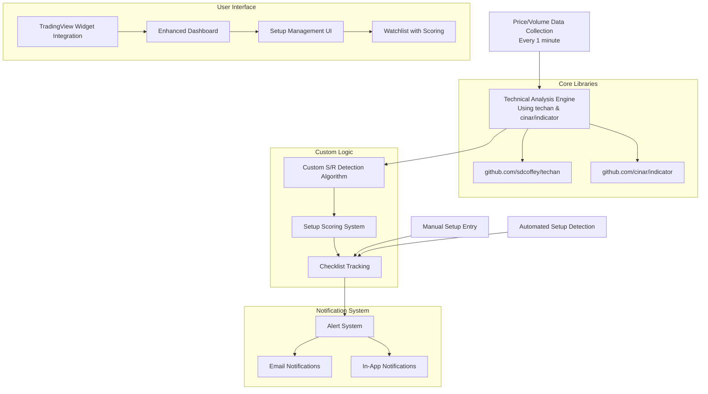

# Market Watch Go - Technical Analysis & Setup Detection System
## Comprehensive Implementation Plan (Library-Based Approach)

> **Goal**: Transform the existing volume tracking application into a sophisticated technical analysis platform focused on **support/resistance bounce detection** using established Go libraries, with comprehensive criteria tracking, TradingView chart integration, and intelligent alerting.

## 🎯 System Overview



## 📚 Library Integration Strategy

### Primary Libraries
- **`github.com/sdcoffey/techan`** - Main technical analysis library
- **`github.com/cinar/indicator`** - Backup/supplementary indicators
- **Existing infrastructure** - Gin, SQLite, cron scheduling

### What Libraries Provide
✅ **RSI, MACD, Moving Averages** - Battle-tested implementations  
✅ **Bollinger Bands, Stochastic** - Additional indicators  
✅ **Time Series Management** - Efficient OHLCV data structures  
✅ **Mathematical Precision** - Accurate financial calculations  

### What We Build Custom
🔧 **Support/Resistance Detection** - Our specific bounce algorithms  
🔧 **Setup Scoring System** - 100-point quality assessment  
🔧 **Checklist Framework** - Interactive criteria tracking  
🔧 **Alert Engine** - Multi-channel notifications  
🔧 **TradingView Integration** - Chart widgets with overlays  

## 📋 Core Features

### 1. Technical Analysis Engine (Library-Powered)

#### Core Indicators (via techan)
```go
// RSI with customizable periods
rsi14 := techan.NewRelativeStrengthIndexIndicator(closePrices, 14)
rsi30 := techan.NewRelativeStrengthIndexIndicator(closePrices, 30)

// MACD with signal line
macd := techan.NewMACDIndicator(closePrices, 12, 26)
macdSignal := techan.NewEMAIndicator(macd, 9)

// Moving Averages
sma20 := techan.NewSMAIndicator(closePrices, 20)
ema50 := techan.NewEMAIndicator(closePrices, 50)

// Volume indicators
vwap := techan.NewVWAPIndicator(series)
```

#### Custom Support/Resistance Detection
- **Pivot Point Analysis** - Identify potential S/R levels
- **Volume Profile Integration** - Volume-confirmed levels
- **Multi-Timeframe Validation** - Cross-timeframe confluence
- **Level Strength Scoring** - Based on touches, volume, duration

### 2. Setup Detection & Scoring System

#### Comprehensive Scoring Algorithm (0-100 points)
- **Price Action Score (0-25 points)**
  - Level strength based on historical touches
  - Bounce magnitude from support/resistance  
  - Time spent at level before bounce
  - Rejection candle patterns (via custom detection)

- **Volume Confirmation Score (0-25 points)**
  - Volume spike analysis using techan volume indicators
  - Volume trend during approach to level
  - Relative volume strength vs historical averages

- **Technical Indicator Score (0-25 points)**
  - RSI oversold/overbought conditions (techan RSI)
  - MACD bullish/bearish divergence (techan MACD)
  - Moving average confluence (techan SMA/EMA)
  - Custom momentum divergence detection

- **Risk/Reward Score (0-25 points)**
  - Clear stop loss identification
  - Risk/reward ratio calculation
  - Position sizing optimization
  - Entry point precision

#### Setup Quality Classifications
- **High Quality (80-100)**: 🟢 Premium setups with strong confluence
- **Medium Quality (60-79)**: 🟡 Good setups with moderate confidence
- **Low Quality (40-59)**: 🟠 Marginal setups requiring careful analysis
- **Poor Quality (0-39)**: 🔴 Weak setups, likely to be filtered out

### 3. Interactive Setup Checklist System

#### Price Action Criteria
- [ ] **Minimum Level Touches**: 3+ historical touches at price level
- [ ] **Bounce Strength**: >2% price movement from level
- [ ] **Time at Level**: >30 minutes consolidation before bounce
- [ ] **Rejection Candle**: Clear reversal candle pattern present
- [ ] **Level Duration**: Level held for >5 trading days
- [ ] **Clean Level**: No significant price breaks in last 20 days

#### Volume Criteria (Enhanced with Libraries)
- [ ] **Volume Spike**: >150% of 20-day average (techan volume analysis)
- [ ] **Volume Confirmation**: Increasing volume during bounce
- [ ] **Approach Volume**: Decreasing volume on approach to level
- [ ] **VWAP Relationship**: Price vs VWAP positioning (techan VWAP)
- [ ] **Relative Volume**: Current vs historical volume patterns
- [ ] **Volume Pattern**: Volume supports the price action narrative

#### Technical Indicators (Library-Powered)
- [ ] **RSI Condition**: RSI <30 at support or >70 at resistance (techan RSI)
- [ ] **Moving Average**: Price near key MA (techan SMA/EMA calculations)
- [ ] **MACD Signal**: Bullish/bearish divergence (techan MACD)
- [ ] **Momentum Divergence**: Price vs momentum indicator divergence
- [ ] **Bollinger Bands**: Price relationship to bands (techan BB)
- [ ] **Multiple Timeframe**: Confluence across timeframes

#### Risk Management
- [ ] **Stop Loss Defined**: Clear invalidation level identified
- [ ] **Risk/Reward Ratio**: Minimum 1:2 risk/reward ratio
- [ ] **Position Size**: Calculated based on account risk
- [ ] **Entry Price**: Precise entry level defined
- [ ] **Target Levels**: Multiple profit targets identified
- [ ] **Exit Strategy**: Clear plan for trade management

## 🏗️ Enhanced Technical Architecture

### Updated Dependencies
```go
module market-watch-go

go 1.23.8

require (
    github.com/gin-gonic/gin v1.10.1
    github.com/mattn/go-sqlite3 v1.14.28
    github.com/robfig/cron/v3 v3.0.1
    github.com/sdcoffey/techan v0.12.1      // Primary TA library
    github.com/cinar/indicator v1.3.0       // Backup TA library
    gopkg.in/yaml.v3 v3.0.1
)
```

### Service Layer Architecture

```
internal/
├── services/
│   ├── technical_analysis.go       # Library integration & indicator calculations
│   ├── data_converter.go          # PriceData ↔ techan.TimeSeries conversion
│   ├── pattern_detection.go       # Custom S/R detection algorithms  
│   ├── setup_scoring.go           # Multi-factor setup quality scoring
│   ├── setup_detection.go         # Automated setup detection engine
│   ├── checklist_service.go       # Checklist management and automation
│   ├── alert_service.go           # Alert management and delivery
│   ├── email_service.go           # Email notification service
│   ├── notification_service.go    # In-app notification management
│   └── performance_tracker.go     # Setup performance analytics
├── models/
│   ├── setup.go                   # Setup and checklist models
│   ├── technical_indicators.go    # Technical indicator models
│   ├── support_resistance.go      # S/R level models
│   ├── alerts.go                 # Alert configuration models
│   └── performance.go            # Performance tracking models
├── handlers/
│   ├── setup_handler.go           # Setup management API endpoints
│   ├── analysis_handler.go        # Technical analysis API endpoints
│   ├── alert_handler.go           # Alert configuration API endpoints
│   └── performance_handler.go     # Performance analytics API endpoints
└── algorithms/
    ├── pivot_points.go            # Custom pivot point calculations
    ├── support_resistance.go      # Custom S/R detection algorithms
    ├── pattern_recognition.go     # Custom chart pattern detection
    └── scoring_weights.go         # Scoring algorithm weights
```

### Core Technical Analysis Service

```go
// internal/services/technical_analysis.go
type TechnicalAnalysisService struct {
    db           *database.DB
    seriesCache  map[string]*techan.TimeSeries
    cacheExpiry  map[string]time.Time
    mutex        sync.RWMutex
    cacheTimeout time.Duration
}

type TechnicalIndicators struct {
    Symbol        string    `json:"symbol"`
    Timestamp     time.Time `json:"timestamp"`
    RSI14         float64   `json:"rsi_14"`
    RSI30         float64   `json:"rsi_30"`
    MACD          float64   `json:"macd"`
    MACDSignal    float64   `json:"macd_signal"`
    MACDHistogram float64   `json:"macd_histogram"`
    SMA20         float64   `json:"sma_20"`
    SMA50         float64   `json:"sma_50"`
    EMA20         float64   `json:"ema_20"`
    EMA50         float64   `json:"ema_50"`
    VWAP          float64   `json:"vwap"`
    VolumeRatio   float64   `json:"volume_ratio"`
    BBUpper       float64   `json:"bb_upper"`
    BBMiddle      float64   `json:"bb_middle"`
    BBLower       float64   `json:"bb_lower"`
}

func NewTechnicalAnalysisService(db *database.DB) *TechnicalAnalysisService {
    return &TechnicalAnalysisService{
        db:           db,
        seriesCache:  make(map[string]*techan.TimeSeries),
        cacheExpiry:  make(map[string]time.Time),
        cacheTimeout: 5 * time.Minute, // Cache for 5 minutes
    }
}

func (tas *TechnicalAnalysisService) GetIndicators(symbol string) (*TechnicalIndicators, error) {
    series, err := tas.getOrCreateTimeSeries(symbol)
    if err != nil {
        return nil, err
    }
    
    if series.BarCount() == 0 {
        return nil, fmt.Errorf("no data available for symbol %s", symbol)
    }
    
    lastIndex := series.LastIndex()
    closePrices := techan.NewClosePriceIndicator(series)
    
    // Calculate all indicators using techan
    rsi14 := techan.NewRelativeStrengthIndexIndicator(closePrices, 14)
    rsi30 := techan.NewRelativeStrengthIndexIndicator(closePrices, 30)
    
    macd := techan.NewMACDIndicator(closePrices, 12, 26)
    macdSignal := techan.NewEMAIndicator(macd, 9)
    
    sma20 := techan.NewSMAIndicator(closePrices, 20)
    sma50 := techan.NewSMAIndicator(closePrices, 50)
    ema20 := techan.NewEMAIndicator(closePrices, 20)
    ema50 := techan.NewEMAIndicator(closePrices, 50)
    
    vwap := techan.NewVWAPIndicator(series)
    
    // Bollinger Bands
    bb := techan.NewBollingerBandsIndicator(closePrices, 20, 2.0)
    
    // Volume analysis
    volumeRatio := tas.calculateVolumeRatio(symbol, series)
    
    return &TechnicalIndicators{
        Symbol:        symbol,
        Timestamp:     time.Now(),
        RSI14:         rsi14.Calculate(lastIndex).Float(),
        RSI30:         rsi30.Calculate(lastIndex).Float(),
        MACD:          macd.Calculate(lastIndex).Float(),
        MACDSignal:    macdSignal.Calculate(lastIndex).Float(),
        MACDHistogram: macd.Calculate(lastIndex).Sub(macdSignal.Calculate(lastIndex)).Float(),
        SMA20:         sma20.Calculate(lastIndex).Float(),
        SMA50:         sma50.Calculate(lastIndex).Float(),
        EMA20:         ema20.Calculate(lastIndex).Float(),
        EMA50:         ema50.Calculate(lastIndex).Float(),
        VWAP:          vwap.Calculate(lastIndex).Float(),
        VolumeRatio:   volumeRatio,
        BBUpper:       bb.UpperBand().Calculate(lastIndex).Float(),
        BBMiddle:      bb.MiddleBand().Calculate(lastIndex).Float(),
        BBLower:       bb.LowerBand().Calculate(lastIndex).Float(),
    }, nil
}
```

### Data Conversion Utilities

```go
// internal/services/data_converter.go
func (tas *TechnicalAnalysisService) convertToTechanSeries(priceData []*models.PriceData) *techan.TimeSeries {
    series := techan.NewTimeSeries()
    
    for _, data := range priceData {
        period := techan.NewTimePeriod(data.Timestamp, time.Minute)
        candle := techan.NewCandle(period)
        
        candle.OpenPrice = big.NewFromFloat(data.Open)
        candle.HighPrice = big.NewFromFloat(data.High)
        candle.LowPrice = big.NewFromFloat(data.Low)
        candle.ClosePrice = big.NewFromFloat(data.Close)
        candle.Volume = big.NewFromInt(data.Volume)
        
        series.AddCandle(candle)
    }
    
    return series
}

func (tas *TechnicalAnalysisService) getOrCreateTimeSeries(symbol string) (*techan.TimeSeries, error) {
    tas.mutex.Lock()
    defer tas.mutex.Unlock()
    
    // Check cache
    if series, exists := tas.seriesCache[symbol]; exists {
        if expiry, hasExpiry := tas.cacheExpiry[symbol]; hasExpiry && time.Now().Before(expiry) {
            return series, nil
        }
    }
    
    // Fetch fresh data from database
    priceData, err := tas.db.GetPriceData(&models.PriceDataFilter{
        Symbol: symbol,
        From:   time.Now().AddDate(0, 0, -30), // Last 30 days
        To:     time.Now(),
        Limit:  10000,
    })
    if err != nil {
        return nil, fmt.Errorf("failed to get price data: %w", err)
    }
    
    // Convert to techan series
    series := tas.convertToTechanSeries(priceData.Data)
    
    // Update cache
    tas.seriesCache[symbol] = series
    tas.cacheExpiry[symbol] = time.Now().Add(tas.cacheTimeout)
    
    return series, nil
}
```

## 📊 Revised Implementation Phases

### Phase 1: Library Integration & Core Indicators (Weeks 1-2)
**Goal**: Integrate technical analysis libraries and build core calculation services

#### Week 1: Library Setup & Basic Indicators
- [ ] Add techan and cinar/indicator to go.mod
- [ ] Create TechnicalAnalysisService with techan integration
- [ ] Implement data conversion utilities (PriceData → TimeSeries)
- [ ] Build RSI calculation service using techan
- [ ] Build MACD calculation service using techan  
- [ ] Build Moving Averages service using techan
- [ ] Create comprehensive unit tests for all indicators
- [ ] Add indicator caching mechanism for performance

#### Week 2: Advanced Indicators & Volume Analysis
- [ ] Implement Bollinger Bands using techan
- [ ] Add VWAP calculation using techan
- [ ] Create volume analysis service (ratios, patterns)
- [ ] Build indicator history storage in database
- [ ] Create API endpoints for indicator data
- [ ] Add indicator validation and error handling
- [ ] Performance optimization and caching strategy

### Phase 2: Custom S/R Detection & Setup Scoring (Weeks 3-4)  
**Goal**: Build custom algorithms on top of library foundation

#### Week 3: Support/Resistance Detection
- [ ] Research and implement pivot point algorithms
- [ ] Create custom S/R level detection service
- [ ] Build level strength scoring algorithm using techan data
- [ ] Add level validation and filtering logic
- [ ] Create S/R database schema and models
- [ ] Integrate S/R detection with minute-by-minute data pipeline

#### Week 4: Setup Detection & Scoring
- [ ] Design multi-factor scoring methodology  
- [ ] Implement price action scoring (using techan price data)
- [ ] Create volume confirmation scoring (using techan volume indicators)
- [ ] Build technical indicator scoring (using techan calculations)
- [ ] Add risk/reward ratio calculations
- [ ] Create setup detection engine with lifecycle management

### Phase 3: Checklist System & Enhanced UI (Weeks 5-6)
**Goal**: Build interactive checklist and enhance user interface

#### Week 5: Dynamic Checklist Framework
- [ ] Design automated criteria detection system
- [ ] Implement RSI-based criteria (using techan RSI)
- [ ] Add MACD-based criteria (using techan MACD)
- [ ] Create volume-based criteria (using techan volume analysis)
- [ ] Build manual checklist override system
- [ ] Add checklist progress tracking and scoring integration

#### Week 6: Enhanced Dashboard with TradingView
- [ ] Replace D3 charts with TradingView widgets
- [ ] Add support/resistance line overlays to TradingView
- [ ] Create enhanced watchlist with live quality scores
- [ ] Build setup detail view interface  
- [ ] Implement interactive checklist UI
- [ ] Add real-time indicator and score updates

### Phase 4: Alert System & Production Features (Weeks 7-8)
**Goal**: Complete notification infrastructure and production readiness

#### Week 7: Alert Engine
- [ ] Design configurable alert threshold system
- [ ] Implement setup quality score alerts
- [ ] Create indicator-based alerts (RSI, MACD thresholds)
- [ ] Build alert delivery engine with multiple channels
- [ ] Add alert history tracking and management
- [ ] Create alert configuration UI

#### Week 8: Notifications & Performance
- [ ] Implement email service with HTML templates
- [ ] Build in-app notification system with WebSocket
- [ ] Add notification center UI and preferences
- [ ] Performance optimization for real-time updates
- [ ] Add comprehensive logging and monitoring
- [ ] Create setup performance tracking and analytics

## ⚙️ Enhanced Configuration

### Updated Configuration with Library Settings
```yaml
# Data Collection Settings
collection:
  interval: "1m"  # 1 minute during trading hours
  symbols:
    - "PLTR"
    - "TSLA"
    - "BBAI"
    - "MSFT"
    - "NPWR"
  market_hours:
    start: "09:30"
    end: "16:00"
    timezone: "America/New_York"

# Technical Analysis Settings (Library-Based)
technical_analysis:
  cache_timeout: "5m"  # How long to cache TimeSeries data
  
  indicators:
    rsi_periods: [14, 30]
    rsi_oversold: 30
    rsi_overbought: 70
    macd_fast: 12
    macd_slow: 26
    macd_signal: 9
    moving_averages: [20, 50, 200]
    bollinger_period: 20
    bollinger_deviation: 2.0
    volume_average_period: 20
  
  support_resistance:
    min_touches: 3
    lookback_days: 30
    strength_calculation: "weighted"
    min_level_distance_percent: 1.0
    level_penetration_tolerance: 0.5
    pivot_strength: 5  # Number of bars on each side for pivot confirmation

# Setup Detection Settings
setup_detection:
  quality_thresholds:
    high_quality: 80
    medium_quality: 60
    low_quality: 40
  
  scoring_weights:
    price_action: 25
    volume_confirmation: 25
    technical_indicators: 25
    risk_reward: 25
  
  bounce_criteria:
    min_bounce_percent: 2.0
    min_time_at_level_minutes: 30
    max_level_age_days: 60

# Alert Configuration
alerts:
  default_thresholds:
    setup_quality: 70
    score_improvement: 10
    score_degradation: 15
    rsi_oversold: 25
    rsi_overbought: 75
    volume_spike_percent: 150
  
  email:
    enabled: true
    smtp_host: "${SMTP_HOST}"
    smtp_port: 587
    username: "${SMTP_USERNAME}"
    password: "${SMTP_PASSWORD}"
    from_email: "${FROM_EMAIL}"
    
  in_app:
    enabled: true
    sound_alerts: false
    desktop_notifications: true
    
  delivery:
    max_alerts_per_hour: 10
    quiet_hours_start: "22:00"
    quiet_hours_end: "08:00"
```

## 🎯 Key Benefits of Library-Based Approach

### Development Speed
⚡ **2-3 weeks saved** on indicator implementation  
⚡ **Battle-tested algorithms** - no debugging mathematical formulas  
⚡ **Focus on unique value** - setup detection and scoring logic  

### Reliability & Accuracy  
✅ **Industry-standard calculations** - peer-reviewed implementations  
✅ **Edge case handling** - libraries handle market holidays, gaps, etc.  
✅ **Performance optimized** - efficient time series operations  

### Maintainability
🔧 **Library updates** - automatic improvements and bug fixes  
🔧 **Documentation** - well-documented APIs and examples  
🔧 **Community support** - active maintenance and feature additions  

## 🚀 Success Metrics

### Technical Performance
- **Setup Detection Accuracy**: >85% using library-calculated indicators
- **Indicator Calculation Speed**: <100ms for full technical analysis
- **System Response Time**: <500ms for setup scoring updates  
- **Data Processing**: Real-time minute-by-minute analysis during market hours

### Setup Quality Metrics  
- **High Quality Setup Rate**: >20% of detected setups score >80 using techan indicators
- **Technical Accuracy**: 99.9% indicator calculation accuracy via established libraries
- **Alert Relevance**: >90% of alerts actionable using precise technical analysis

This library-based approach will accelerate development significantly while ensuring our technical analysis is mathematically accurate and industry-standard. We can focus our custom development on the unique value-add features that differentiate our platform.

---

**Next Steps**: Ready to switch to code mode and begin implementing the library integration and core technical analysis service!
